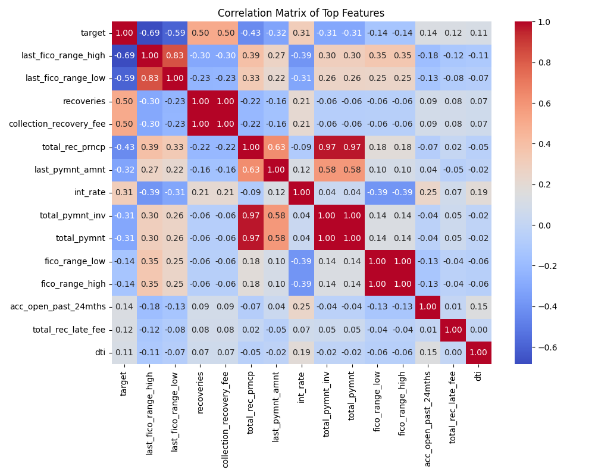
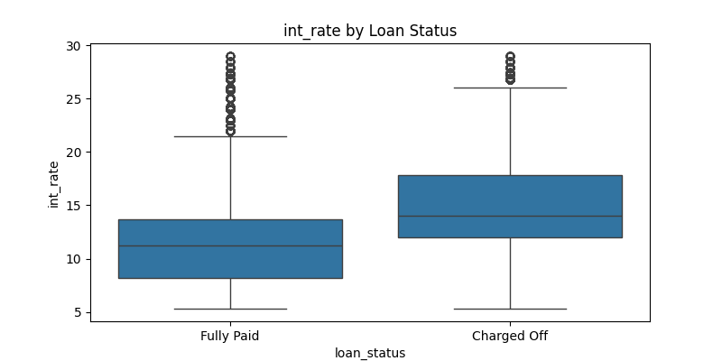
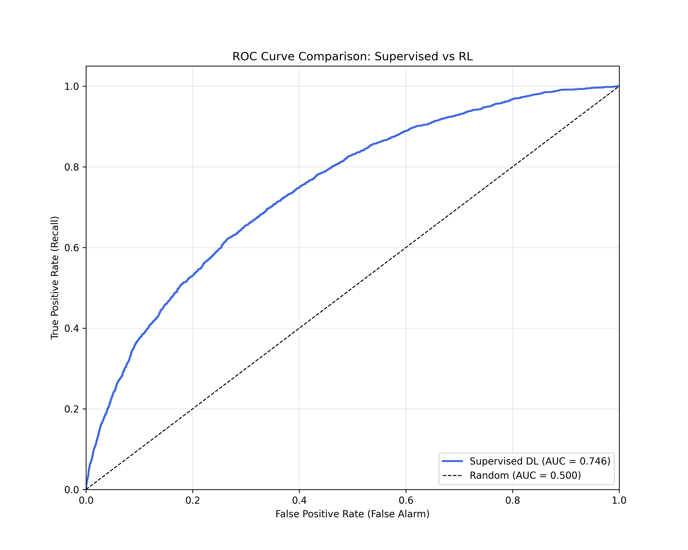
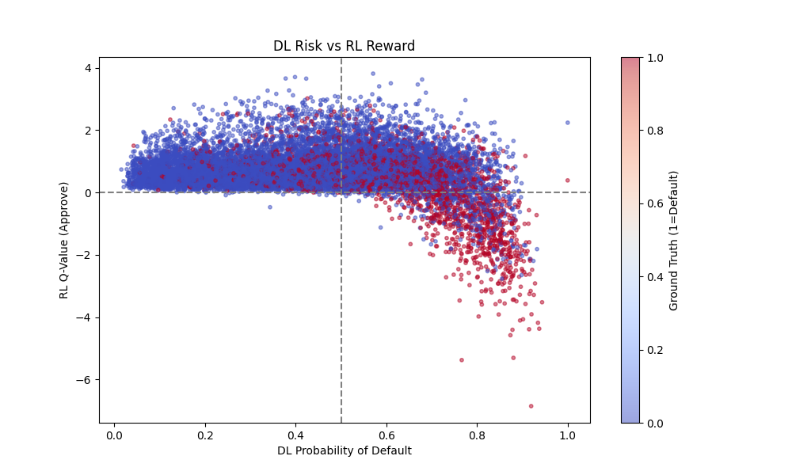
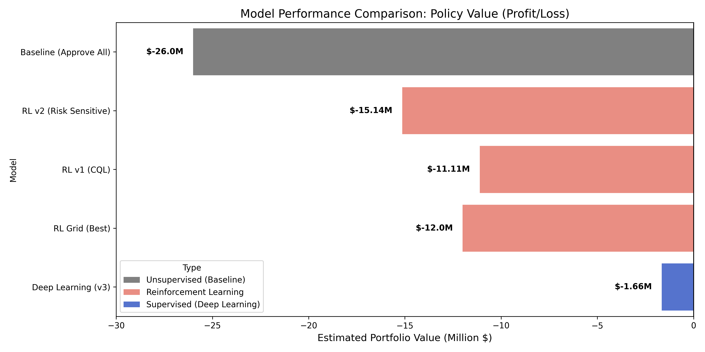

# Financial Policy Optimization with Reinforcement Learning


A comprehensive project exploring the transition from **Supervised Deep Learning** to **Offline Reinforcement Learning** for optimizing loan approval policies.

## 📌 Project Overview

The goal of this project is to build an automated decision system for loan approvals using the [Lending Club Dataset](https://www.kaggle.com/wordsforthewise/lending-club). We aim to minimize defaults while maximizing interest profit.

We compare two distinct approaches:

1.  **Deep Learning (Supervised)**: Predicting the _Probability of Default_ and thresholding it.
2.  **Offline Reinforcement Learning (CQL)**: Learning a policy directly from historical data to maximize _Profit_.

---

## 📊 Exploratory Data Analysis (EDA)

Before modeling, we performed a deep dive into the dataset to understand the risk factors.

### 1. Feature Correlations

We found that **Interest Rate** is the single strongest predictor of default (+0.31 correlation). This makes sense: risky borrowers are charged higher rates.


### 2. The "Yield" Trap

Higher interest rates are correlated with higher default rates. A naive algorithm might chase the high yields (interest) without fully accounting for the loss of principal (default).

_Orange: Charged Off (Default), Blue: Fully Paid. Note the shift to the right for defaults._

---

## 🧠 Approach 1: Supervised Deep Learning

We built a **Multi-Layer Perceptron (MLP)** Classifier to predict the likelihood of a borrower defaulting.

### Model Architecture

- **Input**: 149 features (after One-Hot Encoding).
- **Hidden Layers**: 2 layers (128 units, 64 units) with ReLU and BatchNorm.
- **Regularization**: Dropout (0.3).
- **Optimization**: **Weighted BCE Loss** (`pos_weight=4.0`) was critical to handle the class imbalance (Defaults are rare, ~20%).

### Results

The model achieved an **F1 Score of 0.45**, significantly outperforming baseline Logistic Regression (0.31).

_The DL model (AUC 0.75) effectively ranks borrowers by risk._

---

## 🤖 Approach 2: Offline Reinforcement Learning

We then framed the problem as a Markov Decision Process (MDP) to see if an RL agent could learn a better policy than "Predict & Threshold".

- **State**: 149 Borrower Features.
- **Action**: Approve (1) or Deny (0).
- **Reward**:
  - If Paid: `Loan Amount * Interest Rate` (Profit)
  - If Default: `-1.0 * Loan Amount` (Loss of Principal).

### The Challenge: Behavioral Bias

We trained a **Conservative Q-Learning (CQL)** agent. However, because the dataset only contains _approved_ loans (we don't know the outcome of rejected loans), the agent struggled to learn the "Deny" action effectively.


_X-axis: DL Predicted Risk. Y-axis: RL Estimated Value._

> **Insight**: The RL agent (Y-axis) assigns HIGH value to many loans that the DL model (X-axis) identifies as VERY RISKY (>0.8 probability). This confirms the agent is **"Yield Chasing"**—it sees the high interest rate and bets on it, ignoring the risk.

---

## 🚀 Key Results & Conclusion



| Category         | Model                     | Approval Rate | Policy Value |
| :--------------- | :------------------------ | :-----------: | :----------: |
| **Supervised**   | **Deep Learning (v3)**    |   **57.7%**   | **-$1.66M**  |
| **Unsupervised** | Baseline (Approve All)    |     100%      |   -$26.0M    |
| **RL (Offline)** | RL Agent (Best of Grid)   |     90.0%     |   -$12.0M    |
| **RL (Offline)** | RL Agent (Risk-Sensitive) |     93.2%     |   -$15.1M    |
| **RL (Offline)** | RL Agent (CQL Baseline)   |     91.3%     |   -$11.1M    |

> **Verdict**: The **Supervised** approach (Deep Learning) vastly outperforms both the **Unsupervised** baseline and all **Reinforcement Learning** agents on this dataset.

**Conclusion**: The **Deep Learning classifier** is the superior policy engine for this dataset. Offline RL requires either negative samples (rejected loans with outcomes) or a high-fidelity simulator to learn a truly safe policy.

---

## 🔧 How to Run

### Option A: Google Colab (Recommended for A100)

1.  Open [notebooks/colab_runner.ipynb](notebooks/colab_runner.ipynb) in Google Colab.
2.  Upload `accepted_2007_to_2018.csv` to the session storage.
3.  Run all cells. This will execute the full pipeline (Preprocessing -> DL Training -> RL Training).

### Option B: Local Execution

1. **Install Dependencies**

   ```bash
   pip install -r requirements.txt
   ```

2. **Run Pipeline (Full Dataset)**

   ```bash
   python src/preprocessing.py
   python src/rl_preprocessing.py
   ```

3. **Train Models**

   ```bash
   python src/train_dl.py            # Train Deep Learning Model
   python src/augment_with_dl.py     # Add Risk Scores to Data
   python src/train_rl_grid_search.py # Run RL Grid Search
   ```

4. **Run Analysis**
   ```bash
   python notebooks/10_detailed_analysis.py
   ```

---

_Created by Sir Sloth._
