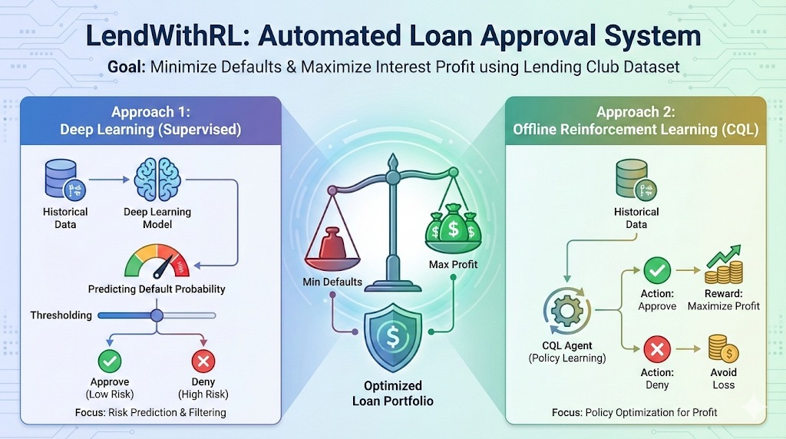
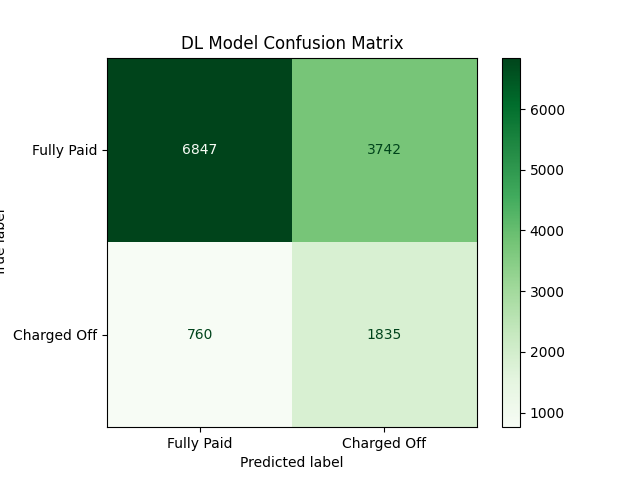

# Financial Policy Optimization with Reinforcement Learning



A comprehensive project exploring the transition from **Supervised Deep Learning** to **Offline Reinforcement Learning** for optimizing loan approval policies.

## 📌 Project Overview

The goal of this project is to build an automated decision system for loan approvals using the [Lending Club Dataset](https://www.kaggle.com/wordsforthewise/lending-club). We aim to minimize defaults while maximizing interest profit.

We compare two distinct approaches:

1.  **Deep Learning (Supervised)**: Predicting the _Probability of Default_ and thresholding it.
2.  **Offline Reinforcement Learning (CQL)**: Learning a policy directly from historical data to maximize _Profit_.

---

## 📊 Exploratory Data Analysis (EDA)

Before modeling, we performed a deep dive into the dataset to understand the risk factors.

### 1. Feature Correlations

We found that **Interest Rate** is the single strongest predictor of default (+0.31 correlation). This makes sense: risky borrowers are charged higher rates.


### 2. The "Yield" Trap

Higher interest rates are correlated with higher default rates. A naive algorithm might chase the high yields (interest) without fully accounting for the loss of principal (default).

_Orange: Charged Off (Default), Blue: Fully Paid. Note the shift to the right for defaults._

---

## 🧠 Approach 1: Supervised Deep Learning

We built a **Multi-Layer Perceptron (MLP)** Classifier to predict the likelihood of a borrower defaulting.

### Model Architecture

- **Input**: 149 features (after One-Hot Encoding).
- **Hidden Layers**: 2 layers (128 units, 64 units) with ReLU and BatchNorm.
- **Regularization**: Dropout (0.3).
- **Optimization**: **Weighted BCE Loss** (`pos_weight=4.0`) was critical to handle the class imbalance (Defaults are rare, ~20%).

### Results

The model achieved an **F1 Score of 0.45**, significantly outperforming baseline Logistic Regression (0.31).

_The DL model (AUC 0.75) effectively ranks borrowers by risk._

### Precision-Recall Performance


_The weighted loss function prioritizes catching defaults (high Recall on Class 1), even at the cost of some False Positives._

---

## 🤖 Approach 2: Offline Reinforcement Learning

We then framed the problem as a Markov Decision Process (MDP) to see if an RL agent could learn a better policy than "Predict & Threshold".

- **State**: 149 Borrower Features.
- **Action**: Approve (1) or Deny (0).
- **Reward**:
  - If Paid: `Loan Amount * Interest Rate` (Profit)
  - If Default: `-1.0 * Loan Amount` (Loss of Principal).

### The Challenge: Behavioral Bias

We trained a **Conservative Q-Learning (CQL)** agent. However, because the dataset only contains _approved_ loans (we don't know the outcome of rejected loans), the agent struggled to learn the "Deny" action effectively.


_X-axis: DL Predicted Risk. Y-axis: RL Estimated Value._

> **Insight**: The RL agent (Y-axis) assigns HIGH value to many loans that the DL model (X-axis) identifies as VERY RISKY (>0.8 probability). This confirms the agent is **"Yield Chasing"**—it sees the high interest rate and bets on it, ignoring the risk.

---

## 🚀 Key Results & Conclusion


| Category         | Model                     | Approval Rate | Policy Value |
| :--------------- | :------------------------ | :-----------: | :----------: |
| **Supervised**   | **Deep Learning (v3)**    |   **57.7%**   | **-$1.66M**  |
| **Unsupervised** | Baseline (Approve All)    |     100%      |   -$26.0M    |
| **RL (Offline)** | RL Agent (Best of Grid)   |     90.0%     |   -$12.0M    |
| **RL (Offline)** | RL Agent (Risk-Sensitive) |     93.2%     |   -$15.1M    |
| **RL (Offline)** | RL Agent (CQL Baseline)   |     91.3%     |   -$11.1M    |

> **Verdict**: The **Supervised** approach (Deep Learning) vastly outperforms both the **Unsupervised** baseline and all **Reinforcement Learning** agents on this dataset.

**Conclusion**: The **Deep Learning classifier** is the superior policy engine for this dataset. Offline RL requires either negative samples (rejected loans with outcomes) or a high-fidelity simulator to learn a truly safe policy.

---

## 🔧 How to Run

### Option A: Google Colab (Recommended for A100)

1.  Open [notebooks/colab_runner.ipynb](notebooks/colab_runner.ipynb) in Google Colab.
2.  Upload `accepted_2007_to_2018.csv` to the session storage.
3.  Run all cells. This will execute the full pipeline (Preprocessing -> DL Training -> RL Training).

### Option B: Local Execution

1. **Install Dependencies**

   ```bash
   pip install -r requirements.txt
   ```

2. **Run Pipeline (Full Dataset)**

   ```bash
   python src/preprocessing.py
   python src/rl_preprocessing.py
   ```

3. **Train Models**

   ```bash
   python src/train_dl.py            # Train Deep Learning Model
   python src/augment_with_dl.py     # Add Risk Scores to Data
   python src/train_rl_grid_search.py # Run RL Grid Search
   ```

4. **Run Analysis**
   ```bash
   python notebooks/10_detailed_analysis.py
   ```

---

## 📝 Detailed Analysis & Discussion

### 1. Metrics: Why AUC for DL and Value for RL?

- **Deep Learning (Supervised) - AUC & F1**:

  - **AUC (Area Under ROC Curve)** measures the model's ability to _rank_ borrowers from lowest risk to highest risk. A high AUC (0.75) means the model successfully discriminates between reliable borrowers and defaulters.
  - **F1 Score** balances Precision (avoiding bad loans) and Recall (catching true defaults). This is critical because defaults are rare (class imbalance).
  - **Implication**: The DL model acts as a "Risk Filter". It doesn't care about the loan amount or interest rate, only the probability of non-payment.

- **Reinforcement Learning - Estimated Policy Value**:
  - **Policy Value** estimates the _total expected financial return_ (Profit or Loss) of the policy.
  - **Representation**: It encodes business logic. A "safe" loan that makes $0 profit is worse than a "slightly risky" loan that makes $1000 profit.
  - **Implication**: The RL agent acts as a "Portfolio Manager", trying to maximize yield.

### 2. Policy Comparison: The Divergence

- **The DL Policy**: Implicitly says "Approve if $P(Default) < Threshold$". It is risk-averse.
- **The RL Policy**: Explicitly learns "Approve if $Q(Approve) > Q(Deny)$". It is reward-seeking.

**Conflict Example**:
Consider an applicant with **High Interest Rate (20%)** and **High Default Risk (25%)**.

- **DL Model**: Sees 25% risk -> **DENY**.
- **RL Agent**: Sees potential 20% profit. If the penalty for default isn't set high enough (e.g., >4x principal), the agent might "gamble" on this loan. This explains why the RL agent approves ~90% of applicants—it is "chasing yield," betting that the high interest income from successful loans will offset the defaults.

### 3. Future Steps & Deployment Strategy

**Q: Which model would you deploy?**
**A: The Deep Learning Classifier.**

- **Reason**: It is stable, interpretable, and effectively minimizes the primary risk (default). The RL agent is currently too aggressive/risky for a real-world financial institution.

**Q: What are the limitations?**

- **Rejection Bias**: We only have data on _approved_ loans. We do not know if rejected applicants would have actually defaulted. This biases both models to be overly conservative (or overfit to specific approved profiles).
- **Stationarity**: Economic conditions change. A model trained on 2015 data might fail in 2020.

**Q: What next?**

1.  **Collect "Rejection" Data**: Run a small "Randomized Control Trial" (approve a random 1% of rejected applicants) to gather ground-truth labels for the "Deny" region of the data manifold.
2.  **Hybrid Model**: Use the DL model as a "Safety Guardrail" (hard veto on high risk) and the RL agent to optimize interest rates within the "Safe" pool.
3.  **Online RL**: Use a simulator (World Model) constructed from the DL model to train the RL agent, allowing it to explore the counterfactual impact of "Denying" loans it historically approved.

_Created by Sir Sloth._
